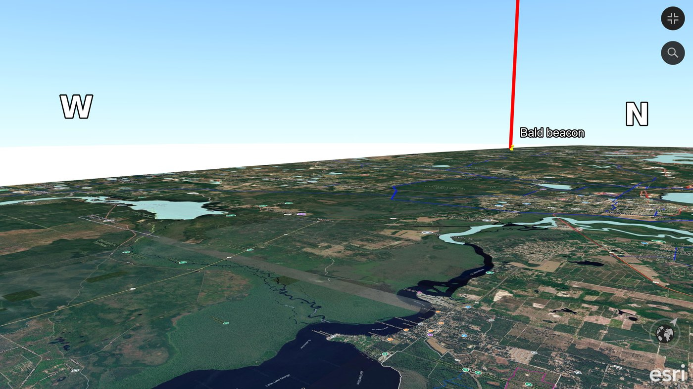
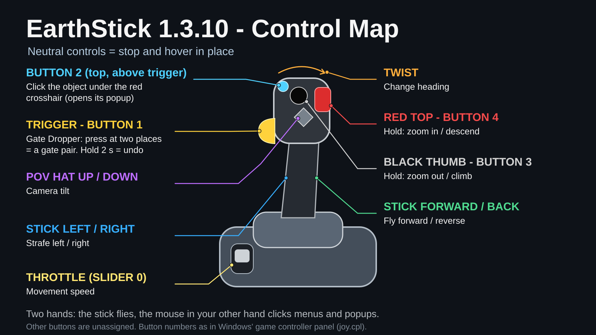
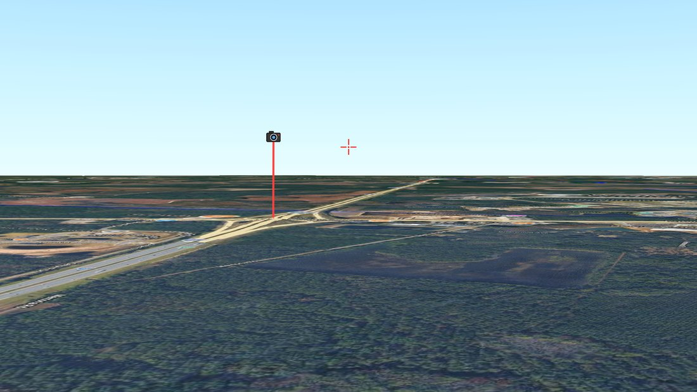
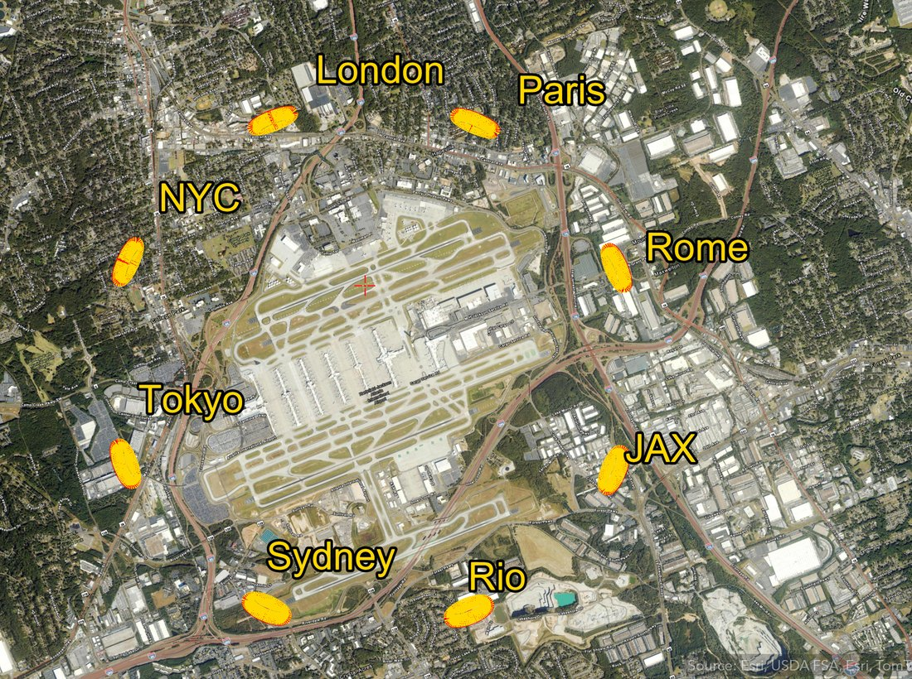
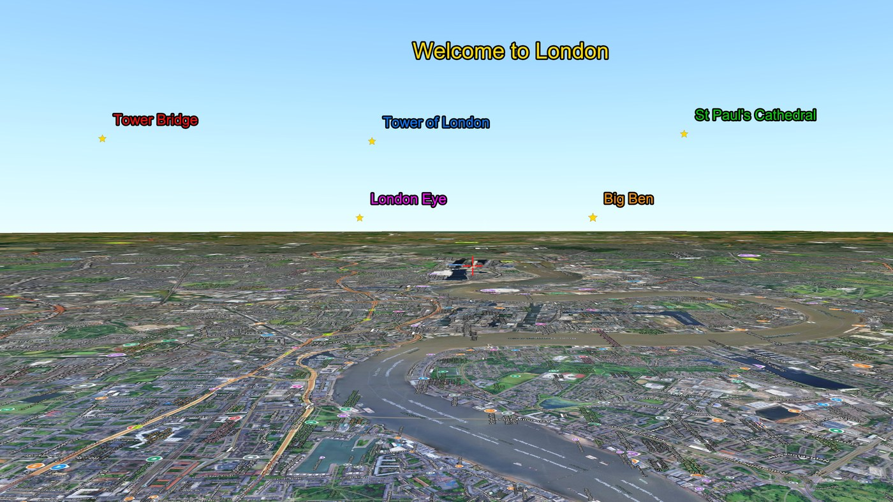
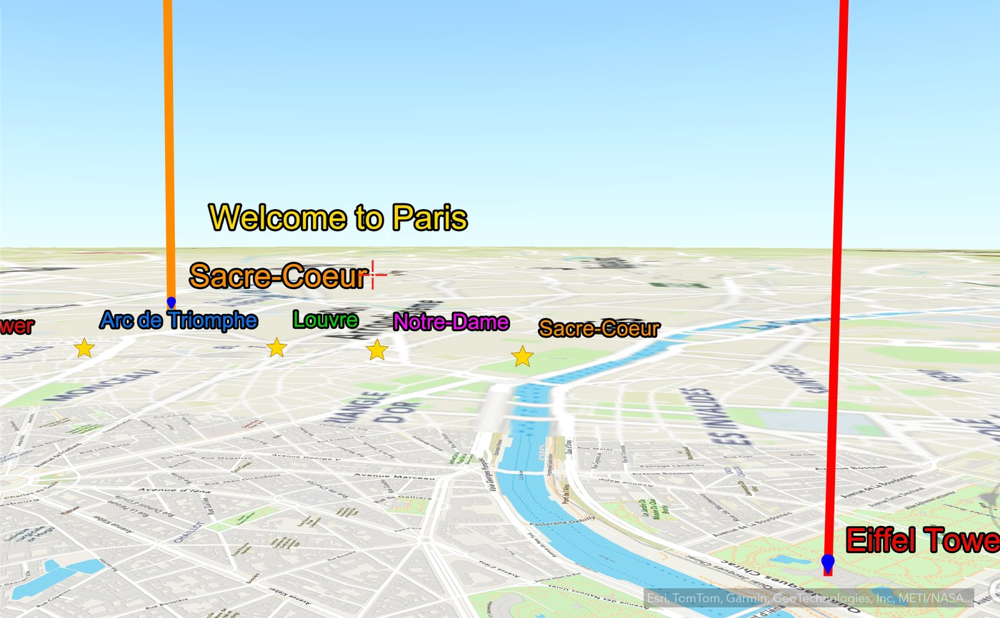
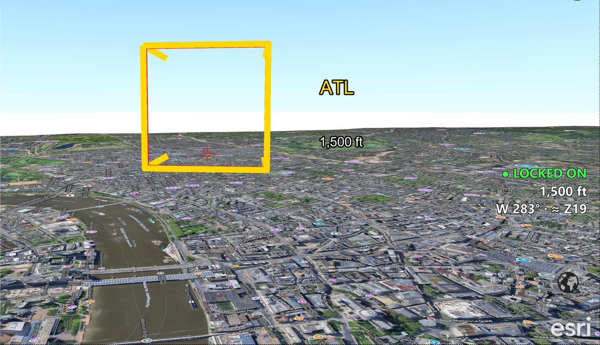

# EarthStick 1.3.4

*The whole setup on one page - click the picture for the full-size version.*

## Get everything you need

**1. ⬇️ [ArcGIS Earth](https://www.esri.com/en-us/arcgis/products/arcgis-earth/downloads)** - free 3D globe from Esri (Windows desktop version). After installing: Settings > Advanced > turn on **Automation API**.

**2. ⬇️ [Python 3](https://www.python.org/downloads/windows/)** - free; install with the default options.

**3. 🕹️ [Thrustmaster TCA Sidestick Airbus Edition](https://www.thrustmaster.com/en-us/products/tca-sidestick-airbus-edition/)** - the joystick EarthStick is built and tested with. **⬇️ [Download and install its driver](https://support.thrustmaster.com/en/product/tca-sidestick-x-airbus-ed-en/#drivers)** first, then plug it in.

> **First time? Three quick tips**
> 1. **Extract the zip first:** right-click the downloaded zip > **Extract All**, then open the new folder. Double-clicking files while they are still inside the zip does not work.
> 2. **Windows security warning:** Windows may warn about any program downloaded from the internet. Click **More info > Run anyway** (blue "Windows protected your PC" screen) or **Run**. To avoid the warning, right-click the zip > **Properties** > tick **Unblock** > **OK** before extracting.
> 3. **Installing Python:** if the installer shows **"Add python.exe to PATH"**, tick it.

### **⬇️ [4. DOWNLOAD EARTHSTICK v1.3.4](releases/EarthStick_v1.3.4.zip)**
**📖 [User manual](docs/USER_GUIDE.md)**
**🗂️ [What's in the zip - every file explained](images/earthstick_whats_in_the_folder_full.png)**

Fly the real map with a Thrustmaster TCA Sidestick and ArcGIS Earth desktop - and fly through golden **World Gates** that take you across the planet. New in 1.3.4: square gates that show you how to line up, a green light when you're at the gate's height, and a tractor beam that guides you through. New in 1.3.3: your height, heading and map zoom on screen, even in full-screen mode. New in 1.3.1 and 1.3.2: a round-the-world tour with welcome signs and one-click site beacons, a bigger crosshair, and a one-click taskbar start.

*Flying the real map: low over the St. Johns River, with an Object Factory beacon and sky compass on the horizon. ▶️ [Watch the video](https://www.youtube.com/watch?v=5Wn14qlC7n4) (YouTube).*

> **ArcGIS Earth Unlocked:** EarthStick is the navigation component of the broader project family. See the [master system map](https://github.com/Jim-dc95811/ArcGIS-Earth-Unlocked) and the [ArcGIS Earth Object Factory](https://github.com/Jim-dc95811/ArcGIS-Earth-Object-Factory).

**Fly the real map.**

EarthStick turns **ArcGIS Earth desktop** into a directly flyable map using a **Thrustmaster TCA Sidestick Airbus Edition**. Instead of simulating an aircraft inside a virtual world, EarthStick gives analog flight-style control to the ArcGIS Earth camera itself.

That means the environment remains a working map: satellite or aerial imagery, roads, street names, place labels, GIS layers, offline tile packages, and other ArcGIS Earth content stay available while you move through it.

> **Neutral controls = stop and hover in place.**

Push forward to travel. Pull back to reverse. Move the stick sideways to strafe. Twist to change heading. Use the throttle slider for speed, the POV hat for camera tilt, and the two top buttons to climb or descend. Release the controls and the camera stays where you left it. Pull the trigger to open the information box of whatever sits under the red crosshair.

## Quick start

1. Install the Thrustmaster driver/control panel and connect the sidestick by USB.
2. Press `Win + R`, run `joy.cpl`, select the T.A320 controller, and verify X/Y, twist/RZ, Slider 0, POV, Button 1 (trigger), Button 3, and Button 4.
3. Open ArcGIS Earth.
4. Open ArcGIS Earth settings and enable **Automation API** under **Advanced**.
5. Leave the default local API address at `http://localhost:8000` unless you intentionally changed it.
6. Extract `EarthStick_v1.3.4.zip` and open the `EarthStick_v1.3.4` folder.
7. Double-click `EarthStick.bat` (or set up the one-click taskbar start - see *One-click start* below).
8. Wait for the console to report `ArcGIS Earth: connected`. If the joystick is not plugged in yet, EarthStick waits for it.
9. Fly.

**What's in the folder you just extracted** (click the picture for a bigger copy):

## Controls

| Physical control | EarthStick action |
|---|---|
| Stick forward / back | Fly forward / reverse |
| Stick left / right | Strafe left / right |
| Stick twist / RZ | Change heading |
| Slider 0 / throttle | Travel speed |
| POV hat up / down | Camera tilt |
| Red top button - Button 4 | Hold to zoom in / descend |
| Black thumb button - Button 3 | Hold to zoom out / climb |
| Trigger - Button 1 | Click the object under the red crosshair (opens its information box; on open map, closes it) |
| Neutral controls | Stop and hover in place |

Other joystick buttons are intentionally unassigned.

### Trigger-click (new in 1.2)

A red crosshair sits in the middle of the ArcGIS Earth window. Fly an object (here, a camera) under it, let go so you hover, and pull the trigger: its information box opens. To close the box, aim at open map and pull the trigger again.

### World Gates (1.3; round-the-world tour in 1.3.1)

*The World Gates hub over Atlanta. ▶️ [Watch the video: ArcGIS Earth Flight - City to City Using Wormholes](https://www.youtube.com/watch?v=2N8-4cWMoPw) (YouTube).*

Golden gates float in the sky. **Fly through one and you come out on the other side of the world.** EarthStick comes with the **World Gates** pack (v21, since 1.3.4):

- **Square gates with legs (new in 1.3.4):** each gate is a gold square with four legs running back the way you fly. Lined up, the legs make an even X; off line, they lean toward where you need to go.
- **Ring-height light and tractor beam (new in 1.3.4):** a green **● RING HEIGHT** comes on above the readout when you're at the height of the gate you're flying toward; get within about a mile and **● LOCKED ON** - EarthStick glides you onto its height. Climb or descend lets go.

- **Jacksonville to Atlanta:** a gate over Jacksonville International takes you to a hub over Atlanta's airport, where eight gates in a circle lead to New York, London, Paris, Rome, Tokyo, Sydney, Rio and home to Jacksonville - connect in Atlanta, just like real flights.
- **Round-the-world tour (new in 1.3.1):** every city also has a gate to the next one - New York, London, Paris, Rome, Tokyo, Sydney, Rio - and Rio's onward gate brings you back to Atlanta. Each city still has its **ATL** gate home.
- **Welcome signs (new in 1.3.1):** you arrive facing the landmark with "Welcome to ..." floating ahead of you, up in the sky.
- **Sites with beacons (new in 1.3.1):** under the sign, five gold stars in two rows name the city's famous sites, all in clear sky well away from the gates. Aim the crosshair at a star and pull the trigger: a beacon in that site's colour shoots up over it to guide you there. To clear a beacon, untick it under **My Drawings** on the left. Atlanta and Jacksonville have their own five sites too.
- Signs, stars and ring names only show when you are near (within about 4 miles), so the view stays clean from far away.

*Coming out of a gate in London (1.3.2): the welcome sign and the city's five sites up in the sky.*

*Paris after two trigger-clicks: orange beacon on Sacré-Cœur, red on the Eiffel Tower.*

1. Open the **World Gates** file in ArcGIS Earth: drag `Gates\World_Gates_JAX_ATL_v21.kmz` (in the EarthStick folder) onto the map, so you can see the gates.
2. Start EarthStick. The console lists the gates it armed: `Wormholes: 22 gate(s) armed: ATL, JAX, NYC, ...`
3. Fly to a gate and put it under the crosshair, gold side toward you (from the red side nothing happens). Look down the legs - an even X means lined up. The green light (and the tractor beam, close in) takes care of the height. Fly through the middle.
4. The view jumps to the destination and the console says `Wormhole: through the ... gate.` You arrive still flying, already facing the landmark.

Gold side = way in. Red side = wrong way. The number under each name is the eye alt to fly at. Want the gates without EarthStick, just to look at? [Download the World Gates file](https://github.com/Jim-dc95811/EarthStick/raw/main/gates/World_Gates_JAX_ATL_v21.kmz) and drag it onto ArcGIS Earth.

**Shortcut to any city:** the `City_Beacons` folder holds nine red beacons (Go to Jacksonville, Go to Atlanta, Go to Paris ...). Drag them onto ArcGIS Earth, then double-click one in the Data list to jump straight there without the gates (you arrive above it; nudge the view to see the beacon). Also available as a [separate download](https://github.com/Jim-dc95811/EarthStick/raw/main/gates/World_Gates_City_Beacons_v2.zip).

### Make your own gates

### **⬇️ [DOWNLOAD WORLD GATE MAKER v1.1](releases/World_Gate_Maker_v1.1.zip)**
**📖 [User manual](docs/WORLD_GATE_MAKER.md)**
**🗂️ [What's in the zip - every file explained](images/world_gate_maker_whats_in_the_zip_full.png)**

Pick two places - home and Central Park, a fire station and a hospital - and World Gate Maker builds a pair of golden gates between them for EarthStick. New in 1.1: square gates with legs, like the World Gates pack - one glance shows the way in.

*Jacksonville to Seattle and back with World Gate Maker 1.1: the "jax" gate home, seen from the side in Seattle.*

Type a name for each place, paste its coordinates from Google Maps (**From Clipboard**), type the ground **elev** from ArcGIS Earth's status bar, choose a height and gate size, and press **MAKE GATES**. The file goes straight into your EarthStick **Gates** folder; restart EarthStick and fly. `World_Gate_Maker_v1.1.zip` SHA-256: `9dd731c0bbc5d9ca6acc19e294a35d95055f09b30af8581b6f4d0b26a2d802e9` ([what changed in 1.1](docs/WORLD_GATE_MAKER_V1.1_CHANGES.md))

### One-click start (new in 1.3.1)

Put **ArcGIS Earth Flight** on your taskbar: one click starts ArcGIS Earth, then EarthStick.

1. In the EarthStick folder, double-click `Make_Taskbar_Shortcut.bat` once. It finds ArcGIS Earth and puts an **ArcGIS Earth Flight** shortcut (ArcGIS Earth icon) on your desktop.
2. Right-click the shortcut > **Show more options** > **Pin to taskbar**.

Clicking it starts ArcGIS Earth (unless it is already open), then EarthStick, which waits until ArcGIS Earth is ready. You can also just double-click `Fly_ArcGIS_Earth.bat`.

## Release details

**EarthStick 1.3.4** (2026-11-05) - World Gates v21 (square gates with legs), the green ring-height light and the tractor beam. Flying, trigger-click and the readout are the same as 1.3.3. See [docs/EARTHSTICK_V1.3.4_CHANGES.md](docs/EARTHSTICK_V1.3.4_CHANGES.md).

`EarthStick_v1.3.4.zip` SHA-256:

`cd600e6281bb07f7281cc1d2097e51d30646c1b605bccd8d6829afd002c2d3d2`

The release contains one folder, `EarthStick_v1.3.4`, holding `EarthStick.py`, `EarthStick.bat`, `Fly_ArcGIS_Earth.bat`, `Make_Taskbar_Shortcut.bat`, `Gates\World_Gates_JAX_ATL_v21.kmz` and a `City_Beacons` folder.

**Earlier releases** (1.3.3, 1.3.2, 1.3.1, 1.3, 1.2, 1.1, 1.0): their zips stay in [`releases/`](releases/) so existing links keep working. What changed in each, with file fingerprints, is in the [release history](CHANGELOG.md) and the change documents listed under *Documentation*.

## What makes EarthStick different

EarthStick is not mouse emulation and it is not keyboard remapping. It reads the joystick through Windows and sends camera position directly through the **ArcGIS Earth Automation API**.

The result is a control model built around observation rather than aircraft physics:

- **hover anywhere** by returning the controls to neutral
- **strafe sideways** without turning
- **reverse** without turning around
- **pivot heading in place**
- **climb or descend independently** of forward motion
- **change travel speed independently** with the throttle slider
- move from street-level inspection to continent-scale travel and back with the same controls
- use the same camera-control model with online maps or offline ArcGIS Earth content

A flight simulator moves an aircraft through scenery. **EarthStick moves you through the map.**

## Requirements

- **Windows 11**
- **ArcGIS Earth desktop**
- **ArcGIS Earth Automation API enabled**
- **Python 3.x** - tested with Python 3.14.5
- **Thrustmaster TCA Sidestick Airbus Edition** connected by USB
- `EarthStick.py` and `EarthStick.bat`
- Thrustmaster driver/control panel recommended

The tested controller appears in Windows as **T.A320 Pilot**. EarthStick also contains a capability-based fallback for installations where WinMM exposes the device using a generic joystick-driver name.

## Documentation

How EarthStick works inside - the movement math, technical constants, architecture and how it recovers when the joystick or ArcGIS Earth drops out - is in [`docs/TECHNICAL_NOTES.md`](docs/TECHNICAL_NOTES.md).

- [`docs/USER_GUIDE.md`](docs/USER_GUIDE.md) - installation and operation
- [`docs/EarthStick_User_Guide.pdf`](docs/EarthStick_User_Guide.pdf) - printable user guide
- [`docs/TECHNICAL_NOTES.md`](docs/TECHNICAL_NOTES.md) - architecture, movement math, API recovery, constants
- [`docs/TROUBLESHOOTING.md`](docs/TROUBLESHOOTING.md) - failure checks and recovery
- [`docs/HARDWARE_MAP.md`](docs/HARDWARE_MAP.md) - tested controller mapping
- [`docs/WORLD_GATE_MAKER.md`](docs/WORLD_GATE_MAKER.md) - World Gate Maker user manual ([PDF](docs/World_Gate_Maker_User_Manual.pdf))
- [`docs/EARTHSTICK_V1.3.4_CHANGES.md`](docs/EARTHSTICK_V1.3.4_CHANGES.md) - 1.3.4 change document (square gates, ring-height light, tractor beam)
- [`docs/EARTHSTICK_V1.3.3_CHANGES.md`](docs/EARTHSTICK_V1.3.3_CHANGES.md) - 1.3.3 change document (height / heading / zoom readout)
- [`docs/EARTHSTICK_V1.3.2_CHANGES.md`](docs/EARTHSTICK_V1.3.2_CHANGES.md) - 1.3.2 change document (World Gates v19)
- [`docs/EARTHSTICK_V1.3.1_CHANGES.md`](docs/EARTHSTICK_V1.3.1_CHANGES.md) - 1.3.1 change document
- [`docs/EARTHSTICK_V1.3_CHANGES.md`](docs/EARTHSTICK_V1.3_CHANGES.md) - 1.3 change document and verification record
- [`docs/EARTHSTICK_V1.2_CHANGES.md`](docs/EARTHSTICK_V1.2_CHANGES.md) - 1.2 change document
- [`docs/EARTHSTICK_V1.1_CHANGES.md`](docs/EARTHSTICK_V1.1_CHANGES.md) - 1.1 change document
- [`CHANGELOG.md`](CHANGELOG.md) - release history

## Safety and scope

EarthStick controls the **ArcGIS Earth map camera**. It is not an aircraft flight-control system, certified navigation system, dispatch system, or safety-of-life product. Users remain responsible for validating maps, layers, imagery, coordinates, and operational procedures.

## License

MIT License. See [`LICENSE`](LICENSE).

## References

- Esri - ArcGIS Earth Automation API overview: https://doc.arcgis.com/en/arcgis-earth/automation-api/overview.htm
- Esri - Using ArcGIS Earth Automation API: https://doc.arcgis.com/en/arcgis-earth/automation-api/use-api.htm
- Esri - Set Camera: https://doc.arcgis.com/en/arcgis-earth/automation-api/set-camera.htm
- Thrustmaster - TCA Sidestick Airbus Edition: https://www.thrustmaster.com/en-us/products/tca-sidestick-airbus-edition/
- Microsoft - `joyGetPosEx`: https://learn.microsoft.com/en-us/windows/win32/api/joystickapi/nf-joystickapi-joygetposex

## Status

**EarthStick 1.3.4 is the current release.** The previous packages remain at `releases/EarthStick_v1.3.3.zip`, `releases/EarthStick_v1.3.2.zip`, `releases/EarthStick_v1.3.1.zip`, `releases/EarthStick_v1.3.zip`, `releases/EarthStick_v1.2.zip`, `releases/EarthStick_v1.1.zip` and `releases/EarthStick_v1.0.zip` for existing links.